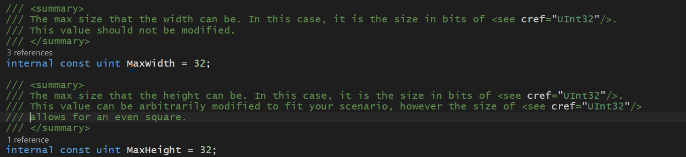

# GridSpace & GridSpaceOrientation

A GridSpace is a spatial reference for an item in your inventory. A grid space comes with three components:

1. A Width
2. A Height
3. An array of rows, where each bit of the row corresponds to whether this item takes up that spot.

GridSpace is used for calculations for possible collisions as well as for generating the user interface for the inventory itself when generating.

## How do I interface with GridSpace

All interfacing with GridSpace will be done through the GridSpace custom editor.

A width and height slider are exposed at the top, and editing these values will shrink or expand the array of buttons on the bottom.

Clicking the "Flood" button will fill each cell with a bit value of 1, meaning the item will take up every space drawn out. The "Clear" button sets every cell to 0, meaning the item will take up no space and can be placed wherever. It is advised that you shrink each item's grid space to its actual dimensions and not to extend further.

## How are the sliders set up?

The sliders use an arbitrary maximum for their max size. Inside GridSpace.cs, you can find the constants used to decide sizes of the grid.

The max height of a GridSpace element can be modified arbitrarily, however modification of this value may cause issues with speed of calculations.

## Orientations

A grid space can have one of four possible orientations: Up, Right, Down, and Left. These orientations, stored in the enum `GridSpaceOrientation`, help with notation regarding the rotation of elements.

When designing a grid space in the Inspector, the designed space will be the space the item takes up when its orientation is set to

## Members

`Width: uint`
The width of the grid space.

`Height: uint`
The height of the grid space.

`Rows: uint[]`
All rows of the grid space.

## Accessors

`this[col: uint | int, row: uint | int]`
If getting the value at this column and row, will return whether the space is occupied (see `SpaceOccupied(uint, uint)`).
If setting the value at this column and row, will directly set the cell value (see `SetCellValue(uint, uint, bool)`).

`this[pos: Vector2Int]`
If getting the value at this position, will return whether the space is occupied (see `SpaceOccupied(Vector2Int)`).
If setting the value at this position, will directly set the cell value (see `SetCellVaue(Vector2Int, bool)`).

## Methods

`SpaceOccupied(col: uint, row: uint) | SpaceOccupied(pos: Vector2Int) -> bool`
Checks whether the space is occupied at the row and column specified. If in the Inspector the value at this row and column is checked, `SpaceOccupied` will return `true`.

`SetCellValue(col: uint, row: uint, on: bool) | SetCellValue(location: Vector2Int, on: bool) -> void`
Sets a cell's value. This function does nothing if the location is outside of the bounds of this grid space.

`CanAccommodate(other: GridSpace, delta: Vector2Int) -> void`
Checks whether this grid space can accommodate an other grid space at the specified delta. If the delta of this other grid space has any negative value (x or y) or the delta plus the other grid space's width or height exceeds this grid space's width or height, this automatically returns `false`. Otherwise, this will check each row and shift cell values over. If each row, when checking the union of every other row, matches the row needed, this will return `true`. Otherwise, this returns `false`.

`MarkSpaceAsReserved(reservedSpace: GridSpace, delta: Vector2Int) -> void`
Marks every unreserved space that `reservedSpace` overlaps with as `false`. This does nothing if this grid space cannot accommodate the reserved space (see `CanAccommodate(GridSpace, Vector2Int)`).

`UnreserveSpace(reservedSpace: GridSpace, delta: Vector2Int) -> void`
Marks all spaces that `reservedSpace` overlaps with as `true`. This undoes the work of `MarkSpaceAsReserved(GridSpace, Vector2Int)`.

`Duplicate() -> GridSpace`
Duplicates this grid space, making a deep copy of its inner bit data.

`Rotate(from: GridSpaceOrientation, to: GridSpaceOrientation) -> GridSpace`
Rotates a grid space from a specified orientation to a new orientation. If the from and to orientations are the same, this returns a duplicate of the values. If the values are polar opposites (up to down, left to right, vise versa), this returns a 180\* rotation (see `Flip180()`). If a 90 degree turn is completed, then the algorithm will return a copy where the width and height are swapped and each row and column are turned into columns and rows. If a 270 degree turn is completed, returns the flipped version of a 90 degree turn.

`Flip180() -> GridSpace`
Flips this grid space by 180 degrees. The dimensions of the returned grid space will be identical, however each row and column will be the exact opposite index.

## Implicit Conversions

`GridSpace -> Vector2Int`
Returns a Vector2Int with the size of the grid space as it's X and Y values.
