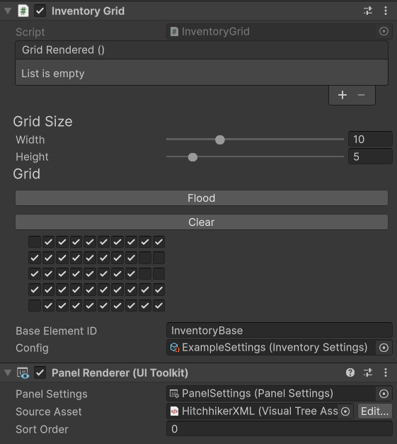

# InventoryGrid

A grid inventory contains multiple items inside it, and can store more items.

## Necessary Setup

In order for the inventory to function, there are multiple pieces of setup that must occur.

1. Adding Required Sister Components

An InventoryGrid component requires a PanelRenderer component attached to the host game object. This means

2. Add the Panel Renderer source asset:

The inventory grid system relies on the Source Asset to know where to generate content. You can create a brand new asset, or modify the asset that is in [UXML/HitchhikerXML.uxml](../UXML/HitchhikerXML.uxml).

Within the UXML file, you will need to specify the name of the areas to load the inventory. You should name the base inventory element a specific name and remember that.

3. Specify the base element inside the Inventory Grid component
   Underneath the grid configuration for the Inventory Grid component, there is a field for the base element. You should put the name of the base element from step 2 into this field.

4. Set up the configuration of this Inventory's settings
   In a separate folder that you'll remember, create an InventorySettings ScriptableObject. Specify all required parameters, and then inside the Inventory Grid component link the Config field to that object.

## Members

`InventorySpace: GridSpace`
The starting organization of the grid itself.

`AvailableSpace: GridSpace`
The current available space in the inventory. When adding items, this field will be modified to reflect the placement of objects.

`BaseElementID: string`
The ID to search for inside the UXML document. This is the same field specified in step 3 of setup.

`CellSize: Vector2Int`
The size of each cell in pixels. This is calculated during run-time, and can only be privately set.

`Config: InventorySettings`
Required settings for the inventory. This is set during step 4 of the setup.

`RootElement: VisualElement`
Gets the root element of the UXML document. Set during run-time.

`InventoryBase: VisualElement`
The element with the same ID as `BaseElementID`. This is private and used to convert positions into local space.

`CurrentItem: InventoryItem`
The current item that is selected. This is set whenever a user clicks an element and unset when a user lets go of an element.

`MousePosition: Vector2`
The mouse position in World Space (scaled to the size of `RootElement`)

`GridMousePosition: Vector2Int`
The mouse position in local space of `InventoryBase`. This is used to help items get their position.

`Items: List<InventoryItem>`
All items currently stored inside the inventory.

`PanelRenderer: PanelRenderer`
The panel renderer. This is the same component that we set up.

## Methods

### Grid Visibility

`ToggleGrid(ctx: CallbackContext) -> void`
Toggles the grid through the new InputSystem callbacks.

`SetGridVisibility(visible: bool) -> void`
Sets the grid visibility. Sets whether the game object is active or not.

`OpenInventory() -> void`
Sets the grid visibility as `true`.

`CloseInventory() -> void`
Sets the grid visibility as `false`.

### Queries

`GetItem(position: Vector2Int) -> InventoryItem`
Gets the item at that position. This is to get references to other items, and is not required to place items. This does a collision query with each item in the Inventory, and thus is quite expensive.

`CanBePlaced(item: InventoryItem) -> bool`
Returns whether an item can be placed at a specified position. Under the hood, uses `GridSpace.CanAccommodate(GridSpace, Vector2Int)` on `AvailableSpace`.

`CanBeCombined(left: InventoryItem, right: InventoryItem)`
Returns whether two items can be combined.

### Adding / Removing Items

`AddItem(item: InventoryItem) -> void`
Places an item into the inventory at the position specified. If the item can be stacked at that position, stacks the item instead. If the item cannot be placed, reverts position and re-places the item there.

`InitItem(item: InventoryItem, reserveSpace: bool = true)`
Initializes an item for the grid inventory. If reserving space, marks the space as reserved in `AvailableSpace`. If the user interface has not been generated yet, requests the interface be generated and adds it to the interface.

`RemoveItem(item: InventoryItem)`
Removes an item from the inventory. If the inventory reserved space for the item, unreserves that space.

`PlaceNearest(item: InventoryItem)`
Currently does nothing.

### Math Calculations

`ConvertToWorldSpace(gridSpace: Vector2Int) -> Vector2`
Converts local grid coordinates to world coordinates. Used to move grid pieces to their snapped positions.

### Movement / Rotation

`SetActiveItem(item: InventoryItem)`
Sets the active item. Used to pass along events from the new Input system.

`RotateActiveItem(ctx: CallbackContext) -> void`
Passes along an event to rotate the active item.

`RotateActiveItem() -> void`
Rotates the active item. The direction is based on `InventorySettings.RotationDirection`.

### Rendering / Callbacks

`OnUIReload(panelRenderer: PanelRenderer, rootElement: VisualElement, version: int) -> void`
Runs once the UI is loaded. Sets up a chained event for when geometry is loaded.

`AfterCalculations(e: GeometryChangedEvent) -> void`
This runs after the base element for rendering the UI has its geometry generated. This calculates `CellSize` and sets up the initial draw of the UI.

`OnMouseMove(e: MouseMoveEvent) -> void`
A callback set on the root element to keep track of the mouse's global position.

`CreateTileImage(col: float, row: float, )background: Background, addCallbacks: bool) -> VisualElement`
Creates a background tile image. Used during `AfterCalculations(GeometryChangedEvent)` to create the whole background.

`OnMouseOverBackgroundImageCallback(e: MouseOverEvent) -> void`
A temporary function to handle callbacks for when the mouse is over a background cell. This does nothing currently.

`OnMouseOutBackgroundImageCallback(e: MouseOutEvent) -> void`
A temporary function to handle callbacks for when the mouse leaves a background cell. This does nothing currently.
