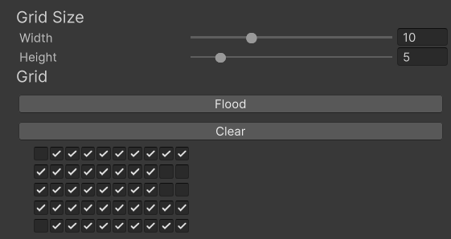

# Hitchhiker | Inventory Management System for Unity

Welcome to the documentation for Hitchhiker! Here you will find some resources about how each component and class works under-the-hood and how to properly use Hitchhiker systems.

## Dependencies

The UI for Hitchhiker is generated using the UI Toolkit package from Unity as it currently stands. The UI Toolkit allows for a more design-focused system.

If you do not have the UI Toolkit package from Unity, please install it before proceeding to the next step.

## Setup

All setup for a grid inventory is detailed inside [InventoryGrid](./Documentation/InventoryGrid.md).

## How To Use

A grid inventory is built entirely inside the Inspector using the GridSpace field (see [GridSpace](./Documentation/GridSpace.md) to understand what it looks like under the hood).

Each inventory can be built through buttons inside the Inspector, like so:

Inventory items also have the exact same setup. When generating the UI for each component, the UI will be generated in accordance to the size specified during run-time, making this completely procedural.

The user interface for the UI can be mostly created through The UI Toolkit Inspector, and the Inventory Grid component will take in specified places where items should be placed.

All settings for the inventory grid can be stored in an InventorySettings ScriptableObject, which will handle drawing the background tiles as well as other optional parameters.

## Example

An example grid can be located inside [Demo Assets/Scenes/inventory_setup.unity](./Demo%20Assets/Scenes/inventory_setup.unity).

## Special Thanks

Shoutout to my fellow students at Rochester Institute of Technology in my IGME 590 | Undergraduate Seminar / Advanced Gameplay Programming for helping me with this project. I was warned plenty of times about using UI Toolkit, and with the help of my fellow students I was able to come to that realization and still pull through.

I would like to give another shoutout to Professor Eric Baker who had us create a Grid Inventory system for IGME 590. This was a fun challenge, and I hope in the future I can flesh this out more.

## Acknowledgement of Generative AI Usage

I did not use generative AI during the creation of this program.

I did use generative AI as a last resort during bug fixing to help me figure out why the game build of this plugin was not the same as the editor build. Given Unity's terrible documentation regarding the runtime feasibility of this feature with dynamically generated content, only after an hour of debugging and following assertion logs did I find out that Unity pre-caches geometry for the UI Toolkit in the editor, and that during runtime I need to wait for the geometry to be generated before calculating anything.

Did generative AI help me here? Not really. It just told me where to not look, and it was weirdly insistent on fixing a symptom and not the root problem.
Did I use it? Yes.
Am I ashamed I used it? Yes.
Will I use it again? For bugs regarding UI Toolkit, absolutely not.
Do I encourage you to use it? No, and I really hope that as a game developer you have a bit more sense than that.
Do I allow you to use it with this plugin? I cannot stop you, but I kindly ask that you do not scrape this plugin to train generative AI models. You also paid money for this presumably, so if you are going to use generative AI you might as well create your own system that is more specialized.

End of rant. Thanks for trying out Hitchhiker!

- binarie / Zach
